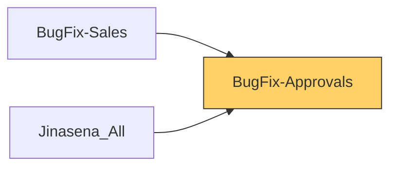

# Functional Documentation — BugFix-Approvals

> Generated by `scripts/generate_functional_docs.py` from branch `Visual_Migration_02` (commit 9fc160c 2026-10-05) and the installed module on the clean environment. For every attribute: **Function** = what it does, **Depends on** = the attributes it relies on (owning module in brackets when it is not this repo), **Used by** = the attributes in any Jinasena repo that rely on it.

| Item | Value |
|---|---|
| Technical name | `BugFix-Approvals` |
| Title | Jinasena : Module : Approvals |
| Version | `17.0.0.0.11` |
| Category | Extra Tools |
| License | LGPL-3 |
| Installed on environment | installed 17.0.0.0.11 |
| History |  |

## Purpose

<!-- SUMMARY:repo -->
BugFix-Approvals carries Jinasena's Studio approval rules and the security groups that act as approvers, ported from the old Studio database so they install on a fresh Odoo 17 system. Approval rules make a user get sign-off from a given group before a button such as Confirm, Approve, Cancel or Mark as Done runs. They affect purchasing, sales, manufacturing and maintenance users, and the approver groups defined here are also used by access rights and approval rules in other Jinasena repos (Purchase, Sales, Accounting, Studio-Misc, Analytics). Of the 45 rules in data/approval_rules.xml, 14 are active and 31 are shipped archived.

- Purchase order approvals: 28 rules on Confirm, Approve, Cancel and reminder mail; the active ones route Confirm to the PO Approvers groups by amount (500,000 or less, above 500,000).
- Sales order approvals: 7 rules on Cancel, Set to Quotation, Send and Unlock.
- Manufacturing order approvals: 9 rules on Mark as Done, Unplan, Scrap, Unbuild, Generate Serial and Forecast report.
- Maintenance request approval on archiving.
- 15 security groups: PO approver tiers, Inventory PR approvers, sales credit limit, overdue, temporary credit, bank guarantee, credit note, margin and commission approvers, POS users, repair sales unlock, plus test groups.
- An override that lets module upgrades re-load approval rules that already have approval entries.
<!-- /SUMMARY -->

## Module dependencies

| Kind | Modules |
|---|---|
| Odoo standard / enterprise | `base_setup`, `base_automation`, `web_studio`, `maintenance`, `mrp`, `purchase`, `sale` |
| Jinasena repos |  |
| Third-party apps |  |
| Used by (Jinasena repos that depend on this one) | `BugFix-Sales`, `Jinasena_All` |

## Contents at a glance

| Attribute type | Count |
|---|---|
| Models extended | 5 |
| Python methods | 1 |
| Approval rules | 45 |
| Security groups | 15 |
| Migration scripts | 1 |

## Models

| Model | Description | Created / extends | Fields | Views | Actions + automations | Approvals |
|---|---|---|---|---|---|---|
| `maintenance.request` | Maintenance Request | extends (maintenance) | 0 | 0 | 0 | 1 |
| `mrp.production` | Production Order | extends (mrp) | 0 | 0 | 0 | 9 |
| `purchase.order` | Purchase Order | extends (purchase) | 0 | 0 | 0 | 28 |
| `sale.order` | Sales Order | extends (sale) | 0 | 0 | 0 | 7 |
| `studio.approval.rule` | Studio Approval Rule | extends (web_studio) | 0 | 0 | 0 | 0 |

### `maintenance.request` — Maintenance Request

*Extends a model created by `maintenance`.*

Other repos that use this model: `automation BugFix-Maintenance.automation_96_mnt_code_gen` (BugFix-Maintenance) `automation BugFix-Maintenance.automation_97_validate_maintenance_request` (BugFix-Maintenance) `server action BugFix-Maintenance.server_action_1566_mnt_code_gen` (BugFix-Maintenance) `server action BugFix-Maintenance.server_action_1637_validate_maintenance_request` (BugFix-Maintenance) `server action BugFix-Maintenance.server_action_1638_mnt_req_planing` (BugFix-Maintenance) `server action BugFix-Maintenance.server_action_1640_mnt_req_inprogress` (BugFix-Maintenance) `server action BugFix-Maintenance.server_action_1642_mnt_req_repaired` (BugFix-Maintenance) `server action BugFix-Maintenance.server_action_1644_mnt_req_scraped` (BugFix-Maintenance)

+11 more
`server action BugFix-Maintenance.server_action_1646_mr_create_for_mnt` (BugFix-Maintenance) `server action BugFix-Maintenance.server_action_1649_mr_create_for_mnt` (BugFix-Maintenance) `server action BugFix-Maintenance.server_action_2318_mr_maintenance_in_progress` (BugFix-Maintenance) `server action BugFix-Maintenance.server_action_2320_mr_maintenance_planning` (BugFix-Maintenance) `server action BugFix-Maintenance.server_action_2322_mr_maintenance_repaired` (BugFix-Maintenance) `server action BugFix-Maintenance.server_action_2324_mr_maintenance_scrap` (BugFix-Maintenance) `server action BugFix-Maintenance.server_action_2326_mr_create_mr_from_maintenance_request` (BugFix-Maintenance) `stock.picking.x_studio_maintenance_request_` (BugFix-Stock) `window action BugFix-Maintenance.act_window_668_maintenance_requests` (BugFix-Maintenance) `x_material_request.x_studio_many2one_field_THFu6` (BugFix-Stock) `x_mr_config.x_studio_many2one_field_6cvHX` (BugFix-Stock)

**Summary:**

<!-- SUMMARY:model:maintenance.request -->
This repo adds one active approval rule: archiving an equipment maintenance request (archive_equipment_request) needs an approval from Internal User. No fields, views or code are added.
<!-- /SUMMARY -->

**Approval rules (1):**

| Name | Record name | Approver group | Function | Depends on | Used by |
|---|---|---|---|---|---|
| Maintenance Request/archive_equipment_request (User types / Internal User) (83) | `rule_83_maintenance_request_archive_equipment_request_user_types_int` | User types / Internal User | Before button/method `archive_equipment_request` on Maintenance Request runs, an approval from **User types / Internal User** is required (step 1). | `group base.group_user` (base) `maintenance.request.archive_equipment_request()` (Odoo) `model maintenance.request` (maintenance) |  |

### `mrp.production` — Production Order

*Extends a model created by `mrp`.*

Other repos that use this model: `access right BugFix-MRP.access_5656_administrator___kapila` (BugFix-MRP) `approval rule BugFix-MRP.approval_rule_107_unlock_production_order` (BugFix-MRP) `approval rule BugFix-MRP.approval_rule_108_cancel_production_order` (BugFix-MRP) `automation BugFix-MRP.automation_122_srm_auto_populate_report_type_in_production_order` (BugFix-MRP) `automation BugFix-MRP.automation_330_proj_mark_as_done_validation` (BugFix-MRP) `automation BugFix-MRP.automation_47_update_original_mo_in_mo` (BugFix-MRP) `automation BugFix-MRP.base_automation_46_update_tracking_item_status_in_mo` (BugFix-MRP) `record rule BugFix-MRP.rule_201_mrp_production_multi_company` (BugFix-MRP)

+33 more
`sale.order.line.x_studio_many2one_field_btM1W` (BugFix-Sales) `server action BugFix-Accounting.sa_f5_x_sales_report_model_srm_rpt_costing_work_sheet` (BugFix-Accounting) `server action BugFix-Accounting.sa_f5_x_sales_report_model_srm_rpt_sales_production_purchase_report` (BugFix-Accounting) `server action BugFix-Accounting.server_action_1144_work_center_costing_model_update_journal_entries` (BugFix-Accounting) `server action BugFix-Accounting.server_action_1519_sls_payment_reconciliation_automate` (BugFix-Accounting) `server action BugFix-Accounting.server_action_1726_srm_auto_populate_data` (BugFix-Accounting) `server action BugFix-Accounting.server_action_1763_srm_rpt_sales_production_purchase_report` (BugFix-Accounting) `server action BugFix-Accounting.server_action_2490_srm_rpt_costing_work_sheet` (BugFix-Accounting) `server action BugFix-MRP.sa_f5_mrp_production_proj_mark_as_done_validation` (BugFix-MRP) `server action BugFix-MRP.server_action_1147_mass_produce_serial_numbers` (BugFix-MRP) `server action BugFix-MRP.server_action_1151_mass_produce_serial_numbers_create_original` (BugFix-MRP) `server action BugFix-MRP.server_action_1154_update_tracking_item_status_in_mo` (BugFix-MRP) `server action BugFix-MRP.server_action_1155_update_original_mo_in_mo` (BugFix-MRP) `server action BugFix-MRP.server_action_1156_assign_original_mo_to_work_order` (BugFix-MRP) `server action BugFix-MRP.server_action_1738_srm_auto_populate_report_type_in_production_order` (BugFix-MRP) `server action BugFix-MRP.server_action_2534_finished_products_location_updated` (BugFix-MRP) `server action BugFix-MRP.server_action_2765_proj_mark_as_done_validation` (BugFix-MRP) `server action BugFix-MRP.server_action_3202_mass_produce_serial_numbers_cancel_serial_no` (BugFix-MRP) `server action BugFix-Stock.server_action_1138_work_center_costing_model_create_journal_entries` (BugFix-Stock) `server action BugFix-Stock.server_action_2566_work_center_costing_model_create_journal_entries_original` (BugFix-Stock) `server action BugFix-Studio-Misc.server_action_2799_mst_odoo_data_clean_up` (BugFix-Studio-Misc) `server action BugFix-Studio-Misc.server_action_2883_mst_odoo_data_clean_up_004` (BugFix-Studio-Misc) `stock.lot.x_studio_production_id` (BugFix-Stock) `x_mass_produce_serial.x_studio_production_id` (BugFix-MRP) `x_mass_produce_serial_.x_studio_production_id` (BugFix-MRP) `x_mrp_bom_general_cost.x_studio_prod_bom_general_cost_ids` (BugFix-MRP) `x_mrp_bom_labour_cost.x_studio_prod_bom_labour_cost_ids` (BugFix-MRP) `x_mrp_bom_material_cos.x_studio_prod_bom_material_cost_ids` (BugFix-MRP) `x_mrp_bom_overhead_cos.x_studio_prod_bom_overhead_cost_ids` (BugFix-MRP) `x_rm_production_orders.x_studio_production_id` (BugFix-Accounting) `x_rm_production_varian.x_studio_production_id` (BugFix-Accounting) `x_sales_report_model.x_studio_related_field_oeTJK` (Jinasena_Masterdata_Reporting) `x_sales_report_type.x_studio_production_order_id` (Jinasena_Masterdata_Reporting)

**Summary:**

<!-- SUMMARY:model:mrp.production -->
This repo adds 9 approval rules on production orders, 6 of them active. Active rules require Manufacturing Administrator approval for Mark as Done and Generate Serial, Inventory Administrator approval for the forecast report, the Production Orders Dismantler group for Scrap and Unbuild, and Internal User approval for Unplan. Three further Mark as Done rules for Internal User are shipped archived.
<!-- /SUMMARY -->

**Approval rules (9):**

| Name | Record name | Approver group | Function | Depends on | Used by |
|---|---|---|---|---|---|
| Production Order/action_generate_serial (Manufacturing / Administrator) (100) | `rule_100_production_order_action_generate_serial_manufacturing_admini` | Manufacturing / Administrator | Before button/method `action_generate_serial` on Production Order runs, an approval from **Manufacturing / Administrator** is required (step 1). | `group mrp.group_mrp_manager` (mrp) `model mrp.production` (mrp) `mrp.production.action_generate_serial()` (Odoo) |  |
| Production Order/action_product_forecast_report (Inventory / Jin - Administrator) (101) | `rule_101_production_order_action_product_forecast_report_inventory_ji` | Inventory / Administrator | Before button/method `action_product_forecast_report` on Production Order runs, an approval from **Inventory / Administrator** is required (step 1). | `group stock.group_stock_manager` (stock) `model mrp.production` (mrp) `mrp.production.action_product_forecast_report()` (Odoo) |  |
| Production Order/button_mark_done (Manufacturing / Administrator) (5) | `rule_5_production_order_button_mark_done_manufacturing_administrato` | Manufacturing / Administrator | Before button/method `button_mark_done` on Production Order runs, an approval from **Manufacturing / Administrator** is required (step 1). | `group mrp.group_mrp_manager` (mrp) `model mrp.production` (mrp) `mrp.production.button_mark_done()` (Odoo) |  |
| Production Order/button_mark_done (User types / Internal User) (2) | `rule_2_production_order_button_mark_done_user_types_internal_user_2` | User types / Internal User | Before button/method `button_mark_done` on Production Order runs, an approval from **User types / Internal User** is required (step 1). | `group base.group_user` (base) `model mrp.production` (mrp) `mrp.production.button_mark_done()` (Odoo) |  |
| Production Order/button_mark_done (User types / Internal User) (3) | `rule_3_production_order_button_mark_done_user_types_internal_user_3` | User types / Internal User | Before button/method `button_mark_done` on Production Order runs, an approval from **User types / Internal User** is required (step 1). | `group base.group_user` (base) `model mrp.production` (mrp) `mrp.production.button_mark_done()` (Odoo) |  |
| Production Order/button_mark_done (User types / Internal User) (4) | `rule_4_production_order_button_mark_done_user_types_internal_user_4` | User types / Internal User | Before button/method `button_mark_done` on Production Order runs, an approval from **User types / Internal User** is required (step 1). | `group base.group_user` (base) `model mrp.production` (mrp) `mrp.production.button_mark_done()` (Odoo) |  |
| Production Order/button_scrap (Manufacturing / Jin - Manufacturing -  MO Full Writes with Unbuild) (92) | `rule_92_production_order_button_scrap_manufacturing_jin_manufacturin` | Manufacturing / Jin - Manufacturing - Production Orders Dismantler | Before button/method `button_scrap` on Production Order runs, an approval from **Manufacturing / Jin - Manufacturing - Production Orders Dismantler** is required (step 1). | `group BugFix-Studio-Misc.group_g_manufacturing_jin_manufacturing_production_orders_dismantler` (BugFix-Studio-Misc) `model mrp.production` (mrp) `mrp.production.button_scrap()` (Odoo) |  |
| Production Order/button_unbuild (Manufacturing / Jin - Manufacturing -  MO Full Writes with Unbuild) (91) | `rule_91_production_order_button_unbuild_manufacturing_jin_manufactur` | Manufacturing / Jin - Manufacturing - Production Orders Dismantler | Before button/method `button_unbuild` on Production Order runs, an approval from **Manufacturing / Jin - Manufacturing - Production Orders Dismantler** is required (step 1). | `group BugFix-Studio-Misc.group_g_manufacturing_jin_manufacturing_production_orders_dismantler` (BugFix-Studio-Misc) `model mrp.production` (mrp) `mrp.production.button_unbuild()` (Odoo) |  |
| Production Order/button_unplan (User types / Internal User) (1) | `rule_1_production_order_button_unplan_user_types_internal_user_1` | User types / Internal User | Before button/method `button_unplan` on Production Order runs, an approval from **User types / Internal User** is required (step 1). | `group base.group_user` (base) `model mrp.production` (mrp) `mrp.production.button_unplan()` (Odoo) |  |

### `purchase.order` — Purchase Order

*Extends a model created by `purchase`.*

Other repos that use this model: `access right BugFix-Purchase.access_6249_inv___administrator` (BugFix-Purchase) `access right BugFix-Purchase.access_6376_purchase_order` (BugFix-Purchase) `access right BugFix-Purchase.access_6377_purchase_order` (BugFix-Purchase) `access right BugFix-Purchase.access_6870_purchase_order` (BugFix-Purchase) `account.bank.statement.line.x_studio_many2one_field_XhwuI` (BugFix-Accounting) `account.bank.statement.line.x_studio_purchase_id` (BugFix-Accounting) `account.move.x_studio_purchase_id` (BugFix-Accounting) `account.payment.x_studio_many2one_field_XhwuI` (BugFix-Accounting)

+82 more
`account.payment.x_studio_purchase_id` (BugFix-Accounting) `account.payment.x_studio_purchase_order` (BugFix-Accounting) `automation BugFix-Purchase.base_automation_112_imp_validate_negative_qtys` (BugFix-Purchase) `automation BugFix-Purchase.base_automation_18_restrict_delete_in_po` (BugFix-Purchase) `automation BugFix-Purchase.base_automation_192_update_pr_type_parameters` (BugFix-Purchase) `automation BugFix-Purchase.base_automation_232_update_analytic_tag_order_vendor` (BugFix-Purchase) `automation BugFix-Purchase.base_automation_233_update_analytic_tag_order_user` (BugFix-Purchase) `automation BugFix-Purchase.base_automation_87_imp_update_cost_allocation` (BugFix-Purchase) `mail template BugFix-Purchase.mail_template_51_purchase_order_jinasena_pvt_ltd_order_ref_po_01296` (BugFix-Purchase) `mail template BugFix-Purchase.mail_template_52_purchase_order_jinasena_pvt_ltd_order_ref_po_01320` (BugFix-Purchase) `mail template BugFix-Purchase.mail_template_53_purchase_order_jinasena_pvt_ltd_order_ref_po_01320` (BugFix-Purchase) `mail template BugFix-Purchase.mail_template_54_purchase_order_send_rfq_test` (BugFix-Purchase) `mail template BugFix-Purchase.mail_template_57_purchase_order_jinasena_pvt_ltd_order_ref_po_01326` (BugFix-Purchase) `mail template BugFix-Purchase.mail_template_58_purchase_order_send_rfq_test_copy_1` (BugFix-Purchase) `purchase.order.x_studio_purchase_order_deliver_remainder` (BugFix-Purchase) `record rule BugFix-Purchase.rule_138_purchase_order_multi_company` (BugFix-Purchase) `record rule BugFix-Purchase.rule_140_portal_purchase_orders` (BugFix-Purchase) `report BugFix-Studio-Misc.action_report_1597_purchase_order_list` (BugFix-Studio-Misc) `report BugFix-Studio-Misc.action_report_1634_indent_cost_estimation_working_backup` (BugFix-Studio-Misc) `report BugFix-Studio-Misc.action_report_1635_indent_cost_estimation` (BugFix-Studio-Misc) `report BugFix-Studio-Misc.action_report_3437_c08_purchase_order` (BugFix-Studio-Misc) `report BugFix-Studio-Misc.action_report_3438_c07_request_for_quotation` (BugFix-Studio-Misc) `server action BugFix-Accounting.server_action_1368_imp_update_consignment_vendor_bill` (BugFix-Accounting) `server action BugFix-Accounting.server_action_1396_imp_update_consignment_vendor_bill` (BugFix-Accounting) `server action BugFix-Purchase.server_action_1007_append_pr_to_rfq` (BugFix-Purchase) `server action BugFix-Purchase.server_action_1010_append_multiple_pr_to_rfq` (BugFix-Purchase) `server action BugFix-Purchase.server_action_1209_imp_create_header_charges` (BugFix-Purchase) `server action BugFix-Purchase.server_action_1212_imp_allocate_header_charges` (BugFix-Purchase) `server action BugFix-Purchase.server_action_1389_imp_validate_payment_method` (BugFix-Purchase) `server action BugFix-Purchase.server_action_1400_imp_create_lc` (BugFix-Purchase) `server action BugFix-Purchase.server_action_1406_imp_change_payment_method_lc` (BugFix-Purchase) `server action BugFix-Purchase.server_action_1455_imp_update_cost_allocation_method_in_rfq` (BugFix-Purchase) `server action BugFix-Purchase.server_action_1698_imp_change_currency_rate` (BugFix-Purchase) `server action BugFix-Purchase.server_action_1699_imp_reset_header_charges` (BugFix-Purchase) `server action BugFix-Purchase.server_action_1700_imp_receive_quotation` (BugFix-Purchase) `server action BugFix-Purchase.server_action_1707_imp_track_unit_price_change_in_po_line` (BugFix-Purchase) `server action BugFix-Purchase.server_action_1708_imp_track_quantity_change_in_po_line` (BugFix-Purchase) `server action BugFix-Purchase.server_action_1712_imp_validate_negative_qtys_in_custom_exchange_rate` (BugFix-Purchase) `server action BugFix-Purchase.server_action_1717_update_actual_spent_in_cash_purchase` (BugFix-Purchase) `server action BugFix-Purchase.server_action_2133_update_pr_type_parameters_in_po` (BugFix-Purchase) `server action BugFix-Purchase.server_action_2254_proj_accept_specification_for_sub_contracting` (BugFix-Purchase) `server action BugFix-Purchase.server_action_2259_proj_send_specification_by_email` (BugFix-Purchase) `server action BugFix-Purchase.server_action_2287_send_specification_by_email_user_manual` (BugFix-Purchase) `server action BugFix-Purchase.server_action_2372_imp_rfq_reverse` (BugFix-Purchase) `server action BugFix-Purchase.server_action_2373_reverse_pr_status_in_po` (BugFix-Purchase) `server action BugFix-Purchase.server_action_2375_reverse_pr_status_in_po_2` (BugFix-Purchase) `server action BugFix-Purchase.server_action_2412_update_analytic_tag_parameters_purchase_order_vend` (BugFix-Purchase) `server action BugFix-Purchase.server_action_2413_update_analytic_tag_parameters_purchase_order_user` (BugFix-Purchase) `server action BugFix-Purchase.server_action_2423_purchase_order_deliver_remainder_cancel` (BugFix-Purchase) `server action BugFix-Purchase.server_action_830_copy_pr_to_rfq` (BugFix-Purchase) `server action BugFix-Purchase.server_action_877_copy_pr_to_rfq_temp_2` (BugFix-Purchase) `server action BugFix-Purchase.server_action_880_copy_multiple_pr_to_rfq` (BugFix-Purchase) `server action BugFix-Purchase.server_action_911_copy_cp_to_po` (BugFix-Purchase) `server action BugFix-Purchase.server_action_917_cash_purchase_cash_settled` (BugFix-Purchase) `server action BugFix-Purchase.server_action_991_update_pr_status_in_po` (BugFix-Purchase) `server action BugFix-Purchase.server_action_994_restrict_delete_in_po_based_on_linked_pr` (BugFix-Purchase) `window action BugFix-Purchase.act_window_2238_subcontracting_pos` (BugFix-Purchase) `window action BugFix-Purchase.act_window_832_related_rfq` (BugFix-Purchase) `window action BugFix-Purchase.act_window_912_related_po` (BugFix-Purchase) `window action BugFix-Purchase.action_2238_subcontracting_pos` (BugFix-Purchase) `window action BugFix-Purchase.action_3648_related_po` (BugFix-Purchase) `window action BugFix-Purchase.action_3650_related_rfq` (BugFix-Purchase) `window action BugFix-Purchase.action_832_related_rfq` (BugFix-Purchase) `window action BugFix-Purchase.action_912_related_po` (BugFix-Purchase) `window action BugFix-Purchase.action_related_po_read_only` (BugFix-Purchase) `window action BugFix-Purchase.action_related_rfq_read_only` (BugFix-Purchase) `window action BugFix-Purchase.aw_f4_purchase_order_related_po` (BugFix-Purchase) `window action BugFix-Purchase.aw_f4_purchase_order_related_rfq` (BugFix-Purchase) `window action BugFix-Purchase.aw_f4_purchase_order_subcontracting_pos` (BugFix-Purchase) `x_consignment_line.x_studio_purchase_id` (BugFix-Stock) `x_import_rfq_charge_he.x_studio_rfq_id` (BugFix-Purchase) `x_import_rfq_charge_li.x_studio_indent` (BugFix-Purchase) `x_import_rfq_charge_li.x_studio_rfq_id` (BugFix-Purchase) `x_lc_header.x_studio_created_from_purchase_order` (BugFix-Accounting) `x_pr_line_cash.x_studio_ref_po` (BugFix-Purchase) `x_purchase.request.line.make.purchase.order.x_purchase_order_id_2` (BugFix-Purchase) `x_purchase.request.line.make.purchase.order.x_purchase_order_id` (BugFix-Purchase) `x_purchase_request._compute_related_purchase_order_count()` (BugFix-Purchase) `x_purchase_request_cas._compute_related_purchase_order_count()` (BugFix-Purchase) `x_purchase_request_lin.x_studio_last_po` (BugFix-Purchase) `x_purchase_request_lin.x_studio_ref_po` (BugFix-Purchase) `x_temp_consignment_lin.x_studio_purchase_id` (BugFix-Stock)

**Summary:**

<!-- SUMMARY:model:purchase.order -->
This repo adds 28 approval rules on purchase orders, of which only 5 are active. The active rules require Confirm to be approved by the PO Approvers 500,000 or less group when the total is up to 500,000 and by the PO Approvers above 500,000 group when it is higher, Approve to be approved by the 500,000 or less group, and Cancel and the reminder mail to be approved by an Internal User. The other 23 rules, older variants with different amount thresholds and groups, are shipped archived.
<!-- /SUMMARY -->

**Approval rules (28):**

| Name | Record name | Approver group | Function | Depends on | Used by |
|---|---|---|---|---|---|
| Purchase Order/button_approve (PO Approval: PO Amount <= 500,000) (74) | `rule_74_purchase_order_button_approve_po_approval_po_amount_500_000_` | Purchase / Jin - PO Approvers: PO Amount <= 500,000 | Before button/method `button_approve` on Purchase Order runs, an approval from **Purchase / Jin - PO Approvers: PO Amount <= 500,000** is required (step 1) when `[['amount_total', '<=', 500000]]`. | `group BugFix-Approvals.group_112_jin_po_approvers_po_amount_500_000` `model purchase.order` (purchase) `purchase.order.amount_total` (purchase) `purchase.order.button_approve()` (Odoo) |  |
| Purchase Order/button_approve (PO Approval: PO Amount > 500,000) (49) | `rule_49_purchase_order_button_approve_po_approval_po_amount_500_000_` | Purchase / Jin - PO Approvers: PO Amount > 500,000 | Before button/method `button_approve` on Purchase Order runs, an approval from **Purchase / Jin - PO Approvers: PO Amount > 500,000** is required (step 1) when `[['amount_total', '>', 500000]]`. | `group BugFix-Approvals.group_113_jin_po_approvers_po_amount_500_000` `model purchase.order` (purchase) `purchase.order.amount_total` (purchase) `purchase.order.button_approve()` (Odoo) |  |
| Purchase Order/button_approve (PO Approval: PO Amount > 500,000) (75) | `rule_75_purchase_order_button_approve_po_approval_po_amount_500_000_` | Purchase / Jin - PO Approvers: PO Amount > 500,000 | Before button/method `button_approve` on Purchase Order runs, an approval from **Purchase / Jin - PO Approvers: PO Amount > 500,000** is required (step 1) when `[['amount_total', '>', 500000]]`. | `group BugFix-Approvals.group_113_jin_po_approvers_po_amount_500_000` `model purchase.order` (purchase) `purchase.order.amount_total` (purchase) `purchase.order.button_approve()` (Odoo) |  |
| Purchase Order/button_approve (PO Approvals: PO Amount <= 500,000) (48) | `rule_48_purchase_order_button_approve_po_approvals_po_amount_500_000` | Purchase / Jin - PO Approvers: PO Amount <= 500,000 | Before button/method `button_approve` on Purchase Order runs, an approval from **Purchase / Jin - PO Approvers: PO Amount <= 500,000** is required (step 1) when `[['amount_total', '<=', 500000]]`. | `group BugFix-Approvals.group_112_jin_po_approvers_po_amount_500_000` `model purchase.order` (purchase) `purchase.order.amount_total` (purchase) `purchase.order.button_approve()` (Odoo) |  |
| Purchase Order/button_approve (Purchase / Jin - PO Approvers: PO Amount <= 500,000) (98) | `rule_98_purchase_order_button_approve_purchase_jin_po_approvers_po_a` | Purchase / Jin - PO Approvers: PO Amount <= 500,000 | Before button/method `button_approve` on Purchase Order runs, an approval from **Purchase / Jin - PO Approvers: PO Amount <= 500,000** is required (step 1). | `group BugFix-Approvals.group_112_jin_po_approvers_po_amount_500_000` `model purchase.order` (purchase) `purchase.order.button_approve()` (Odoo) |  |
| Purchase Order/button_approve (Purchase / User) (67) | `rule_67_purchase_order_button_approve_purchase_user_67` | Purchase / User | Before button/method `button_approve` on Purchase Order runs, an approval from **Purchase / User** is required (step 1) when `[['amount_total', '=', 0]]`. | `group purchase.group_purchase_user` (purchase) `model purchase.order` (purchase) `purchase.order.amount_total` (purchase) `purchase.order.button_approve()` (Odoo) |  |
| Purchase Order/button_approve (Technical / Jin_PO_Creator) (70) | `rule_70_purchase_order_button_approve_technical_jin_po_creator_70` | User types / Internal User | Before button/method `button_approve` on Purchase Order runs, an approval from **User types / Internal User** is required (step 1) when `[['amount_total', '<', 1]]`. | `group base.group_user` (base) `model purchase.order` (purchase) `purchase.order.amount_total` (purchase) `purchase.order.button_approve()` (Odoo) |  |
| Purchase Order/button_approve (Technical / Jin_PO_Creator) (72) | `rule_72_purchase_order_button_approve_technical_jin_po_creator_72` | User types / Internal User | Before button/method `button_approve` on Purchase Order runs, an approval from **User types / Internal User** is required (step 1). | `group base.group_user` (base) `model purchase.order` (purchase) `purchase.order.button_approve()` (Odoo) |  |
| Purchase Order/button_approve (User types / Internal User) (68) | `rule_68_purchase_order_button_approve_user_types_internal_user_68` | User types / Internal User | Before button/method `button_approve` on Purchase Order runs, an approval from **User types / Internal User** is required (step 1) when `[['amount_total', '<', 1]]`. | `group base.group_user` (base) `model purchase.order` (purchase) `purchase.order.amount_total` (purchase) `purchase.order.button_approve()` (Odoo) |  |
| Purchase Order/button_approve (User types / Internal User) (69) | `rule_69_purchase_order_button_approve_user_types_internal_user_69` | User types / Internal User | Before button/method `button_approve` on Purchase Order runs, an approval from **User types / Internal User** is required (step 1). | `group base.group_user` (base) `model purchase.order` (purchase) `purchase.order.button_approve()` (Odoo) |  |
| Purchase Order/button_approve (User types / Internal User) (71) | `rule_71_purchase_order_button_approve_user_types_internal_user_71` | User types / Internal User | Before button/method `button_approve` on Purchase Order runs, an approval from **User types / Internal User** is required (step 1). | `group base.group_user` (base) `model purchase.order` (purchase) `purchase.order.button_approve()` (Odoo) |  |
| Purchase Order/button_approve (User types / Internal User) (73) | `rule_73_purchase_order_button_approve_user_types_internal_user_73` | User types / Internal User | Before button/method `button_approve` on Purchase Order runs, an approval from **User types / Internal User** is required (step 1). | `group base.group_user` (base) `model purchase.order` (purchase) `purchase.order.button_approve()` (Odoo) |  |
| Purchase Order/button_approve (sales / Jin - Credit Note Approvers) (88) | `rule_88_purchase_order_button_approve_sales_jin_credit_note_approver` | Sales / Jin - Sales - Credit Note Approvers | Before button/method `button_approve` on Purchase Order runs, an approval from **Sales / Jin - Sales - Credit Note Approvers** is required (step 1). | `group BugFix-Approvals.group_129_jin_sales_credit_note_approvers` `model purchase.order` (purchase) `purchase.order.button_approve()` (Odoo) |  |
| Purchase Order/button_cancel (Administration / Access Rights) (87) | `rule_87_purchase_order_button_cancel_administration_access_rights_87` | Administration / Access Rights | Before button/method `button_cancel` on Purchase Order runs, an approval from **Administration / Access Rights** is required (step 1). | `group base.group_erp_manager` (base) `model purchase.order` (purchase) `purchase.order.button_cancel()` (Odoo) |  |
| Purchase Order/button_cancel (User types / Internal User) (64) | `rule_64_purchase_order_button_cancel_user_types_internal_user_64` | User types / Internal User | Before button/method `button_cancel` on Purchase Order runs, an approval from **User types / Internal User** is required (step 1). | `group base.group_user` (base) `model purchase.order` (purchase) `purchase.order.button_cancel()` (Odoo) |  |
| Purchase Order/button_confirm (PO Approval - 10,000 < Amount) (13) | `rule_13_purchase_order_button_confirm_po_approval_10_000_amount_13` | Purchase / Jin - PO Approvers: PO Amount > 500,000 | Before button/method `button_confirm` on Purchase Order runs, an approval from **Purchase / Jin - PO Approvers: PO Amount > 500,000** is required (step 1) when `['&', ['amount_total', '>', 10000], ['amount_total', '<=', 20000]]`. | `group BugFix-Approvals.group_113_jin_po_approvers_po_amount_500_000` `model purchase.order` (purchase) `purchase.order.amount_total` (purchase) `purchase.order.button_confirm()` (BugFix-Purchase) |  |
| Purchase Order/button_confirm (PO Approval - 10,000 < Amount) (16) | `rule_16_purchase_order_button_confirm_po_approval_10_000_amount_16` | Purchase / Jin - PO Approvers: PO Amount > 500,000 | Before button/method `button_confirm` on Purchase Order runs, an approval from **Purchase / Jin - PO Approvers: PO Amount > 500,000** is required (step 1) when `[['amount_total', '>', 500000]]`. | `group BugFix-Approvals.group_113_jin_po_approvers_po_amount_500_000` `model purchase.order` (purchase) `purchase.order.amount_total` (purchase) `purchase.order.button_confirm()` (BugFix-Purchase) |  |
| Purchase Order/button_confirm (PO Approval: PO Amount > 500,000) (54) | `rule_54_purchase_order_button_confirm_po_approval_po_amount_500_000_` | Purchase / Jin - PO Approvers: PO Amount > 500,000 | Before button/method `button_confirm` on Purchase Order runs, an approval from **Purchase / Jin - PO Approvers: PO Amount > 500,000** is required (step 1). | `group BugFix-Approvals.group_113_jin_po_approvers_po_amount_500_000` `model purchase.order` (purchase) `purchase.order.button_confirm()` (BugFix-Purchase) |  |
| Purchase Order/button_confirm (PO Approving users) (17) | `rule_17_purchase_order_button_confirm_po_approving_users_17` | Purchase / Jin - PO Approvers: PO Amount <= 500,000 | Before button/method `button_confirm` on Purchase Order runs, an approval from **Purchase / Jin - PO Approvers: PO Amount <= 500,000** is required (step 1) when `[["amount_total","<=",500000]]`. | `group BugFix-Approvals.group_112_jin_po_approvers_po_amount_500_000` `model purchase.order` (purchase) `purchase.order.amount_total` (purchase) `purchase.order.button_confirm()` (BugFix-Purchase) |  |
| Purchase Order/button_confirm (Purchase / Administrator) (7) | `rule_7_purchase_order_button_confirm_purchase_administrator_7` | Purchase / Administrator | Before button/method `button_confirm` on Purchase Order runs, an approval from **Purchase / Administrator** is required (step 1) when `[['amount_total', '<', 1000]]`. | `group purchase.group_purchase_manager` (purchase) `model purchase.order` (purchase) `purchase.order.amount_total` (purchase) `purchase.order.button_confirm()` (BugFix-Purchase) |  |
| Purchase Order/button_confirm (Purchase / Jin - PO Approvers: PO Amount <= 500,000) (89) | `rule_89_purchase_order_button_confirm_purchase_jin_po_approvers_po_a` | Purchase / Jin - PO Approvers: PO Amount <= 500,000 | Before button/method `button_confirm` on Purchase Order runs, an approval from **Purchase / Jin - PO Approvers: PO Amount <= 500,000** is required (step 1) when `[['amount_total', '<=', 500000]]`. | `group BugFix-Approvals.group_112_jin_po_approvers_po_amount_500_000` `model purchase.order` (purchase) `purchase.order.amount_total` (purchase) `purchase.order.button_confirm()` (BugFix-Purchase) |  |
| Purchase Order/button_confirm (Purchase / Jin - PO Approvers: PO Amount > 500,000) (90) | `rule_90_purchase_order_button_confirm_purchase_jin_po_approvers_po_a` | Purchase / Jin - PO Approvers: PO Amount > 500,000 | Before button/method `button_confirm` on Purchase Order runs, an approval from **Purchase / Jin - PO Approvers: PO Amount > 500,000** is required (step 1) when `[['amount_total', '>', 500000]]`. | `group BugFix-Approvals.group_113_jin_po_approvers_po_amount_500_000` `model purchase.order` (purchase) `purchase.order.amount_total` (purchase) `purchase.order.button_confirm()` (BugFix-Purchase) |  |
| Purchase Order/button_confirm (User types / Internal User) (15) | `rule_15_purchase_order_button_confirm_user_types_internal_user_15` | User types / Internal User | Before button/method `button_confirm` on Purchase Order runs, an approval from **User types / Internal User** is required (step 1). | `group base.group_user` (base) `model purchase.order` (purchase) `purchase.order.button_confirm()` (BugFix-Purchase) |  |
| Purchase Order/button_confirm (User types / Internal User) (52) | `rule_52_purchase_order_button_confirm_user_types_internal_user_52` | User types / Internal User | Before button/method `button_confirm` on Purchase Order runs, an approval from **User types / Internal User** is required (step 1). | `group base.group_user` (base) `model purchase.order` (purchase) `purchase.order.button_confirm()` (BugFix-Purchase) |  |
| Purchase Order/button_confirm (User types / Internal User) (53) | `rule_53_purchase_order_button_confirm_user_types_internal_user_53` | User types / Internal User | Before button/method `button_confirm` on Purchase Order runs, an approval from **User types / Internal User** is required (step 1). | `group base.group_user` (base) `model purchase.order` (purchase) `purchase.order.button_confirm()` (BugFix-Purchase) |  |
| Purchase Order/button_confirm (User types / Public) (12) | `rule_12_purchase_order_button_confirm_user_types_public_12` | User types / Public | Before button/method `button_confirm` on Purchase Order runs, an approval from **User types / Public** is required (step 1). | `group base.group_public` (base) `model purchase.order` (purchase) `purchase.order.button_confirm()` (BugFix-Purchase) |  |
| Purchase Order/confirm_reminder_mail (User types / Internal User) (11) | `rule_11_purchase_order_confirm_reminder_mail_user_types_internal_use` | User types / Internal User | Before button/method `confirm_reminder_mail` on Purchase Order runs, an approval from **User types / Internal User** is required (step 1). | `group base.group_user` (base) `model purchase.order` (purchase) `purchase.order.confirm_reminder_mail()` (Odoo) |  |
| Purchase Order/confirm_reminder_mail (User types / Internal User) (14) | `rule_14_purchase_order_confirm_reminder_mail_user_types_internal_use` | User types / Internal User | Before button/method `confirm_reminder_mail` on Purchase Order runs, an approval from **User types / Internal User** is required (step 1). | `group base.group_user` (base) `model purchase.order` (purchase) `purchase.order.confirm_reminder_mail()` (Odoo) |  |

### `sale.order` — Sales Order

*Extends a model created by `sale`.*

Other repos that use this model: `access right BugFix-Sales.access_6086_user` (BugFix-Sales) `access right BugFix-Sales.access_6246_inv___administrator` (BugFix-Sales) `access right BugFix-Sales.access_6849_sales_order` (BugFix-Sales) `account.bank.statement.line.x_studio_many2one_field_re1H2` (BugFix-Accounting) `account.bank.statement.line.x_studio_sale_id` (BugFix-Accounting) `account.move._compute_is_rug_invoice()` (Fix-repair) `account.move._compute_x_studio_rug_confirmed()` (Fix-repair) `account.move.line._delegate_studio_computes_to_native()` (Fix-repair)

+197 more
`account.move.write()` (Fix-repair) `account.move.x_studio_sale_id` (BugFix-Accounting) `account.payment.x_studio_many2one_field_re1H2` (BugFix-Accounting) `account.payment.x_studio_sale_id` (BugFix-Accounting) `account.payment.x_studio_sales_order` (BugFix-Sales) `approval rule BugFix-Sales.ar_final_sales_order_sls_bank_guarantee_approval_sales_bank_guarantee` (BugFix-Sales) `approval rule BugFix-Sales.ar_final_sales_order_sls_create_customer_payment_user_types_internal_` (BugFix-Sales) `approval rule BugFix-Sales.ar_final_sales_order_sls_credit_limit_approval_sales_credit_limit_app` (BugFix-Sales) `approval rule BugFix-Sales.ar_final_sales_order_sls_margin_approval_sales_margin_approver_27` (BugFix-Sales) `approval rule BugFix-Sales.ar_final_sales_order_sls_over_commission_approval_sales_over_commissi` (BugFix-Sales) `approval rule BugFix-Sales.ar_final_sales_order_sls_overdue_approval_sales_overdue_approver_22` (BugFix-Sales) `approval rule BugFix-Sales.ar_final_sales_order_sls_temporary_credit_approval_sales_temporary_cr` (BugFix-Sales) `automation BugFix-Sales.base_automation_147_sls_validate_bank_guarantee_in_so_confirm` (BugFix-Sales) `automation BugFix-Sales.base_automation_169_sls_validate_sos_without_lines` (BugFix-Sales) `automation BugFix-Sales.base_automation_176_rr_auto_generate_quotation_type_for_repair_sos` (BugFix-Sales) `automation BugFix-Sales.base_automation_186_rr_auto_generate_quotation_type_for_project_sos` (BugFix-Sales) `automation BugFix-Sales.base_automation_187_rr_auto_generate_quotation_type_for_project_sos_2` (BugFix-Sales) `automation BugFix-Sales.base_automation_202_rr_track_lock_status` (BugFix-Sales) `automation BugFix-Sales.base_automation_203_rr_track_lock_status_2` (BugFix-Sales) `automation BugFix-Sales.base_automation_205_rr_track_lock_status_4` (BugFix-Sales) `automation BugFix-Sales.base_automation_234_update_analytic_tag_parameters_sales_order_customer` (BugFix-Sales) `automation BugFix-Sales.base_automation_235_update_analytic_tag_parameters_sales_order_user` (BugFix-Sales) `automation BugFix-Sales.base_automation_257_jin_project_sales_order_seq_no` (BugFix-Sales) `automation BugFix-Sales.base_automation_258_jin_project_sales_order_seq_no_maintain_separate_nos_for_pro` (BugFix-Sales) `automation BugFix-Sales.base_automation_259_jin_project_sales_order_seq_no_maintain_separate_nos_for_pro` (BugFix-Sales) `automation BugFix-Sales.base_automation_260_proj_validate_start_date_and_end_date_for_project_sos` (BugFix-Sales) `automation BugFix-Sales.base_automation_341_proj_apply_project_price_list` (BugFix-Sales) `automation BugFix-Sales.base_automation_79_sls_pass_customer_pm_to_so` (BugFix-Sales) `automation BugFix-Sales.base_automation_80_sls_validate_order_payment_type_in_so` (BugFix-Sales) `crossovered.budget.x_studio_created_from_sales_order_1` (BugFix-Accounting) `helpdesk.ticket._delegate_studio_server_actions_to_native()` (Fix-repair) `helpdesk.ticket._get_so_from_serial()` (Fix-repair) `helpdesk.ticket._repair_auto_select_product_for_rug()` (Fix-repair) `helpdesk.ticket._repair_auto_select_product_for_rug_no_company()` (Fix-repair) `helpdesk.ticket._repair_studio_change_repair_type_to_rug()` (Fix-repair) `helpdesk.ticket.x_studio_sale_order` (Fix-repair) `purchase.order.x_studio_subcontracting_so` (BugFix-Purchase) `record rule BugFix-Sales.rule_157_sales_order_multi_company` (BugFix-Sales) `record rule BugFix-Sales.rule_162_portal_personal_quotations_sales_orders` (BugFix-Sales) `record rule BugFix-Sales.rule_164_personal_orders` (BugFix-Sales) `record rule BugFix-Sales.rule_165_all_orders` (BugFix-Sales) `record rule BugFix-Sales.rule_191_subscription_multi_company` (BugFix-Sales) `record rule BugFix-Sales.rule_198_subscription_portal_access` (BugFix-Sales) `record rule BugFix-Sales.rule_337_sales_orders_for_sales_centers` (BugFix-Sales) `record rule BugFix-Sales.rule_500_sales_order_view_only` (BugFix-Sales) `report BugFix-Studio-Misc.action_report_1440_test_report_kapila` (BugFix-Studio-Misc) `report BugFix-Studio-Misc.action_report_3445_jinasena_quotation_1` (BugFix-Studio-Misc) `report BugFix-Studio-Misc.action_report_3446_sales_order_report` (BugFix-Studio-Misc) `report BugFix-Studio-Misc.action_report_3449_jinasena_quotation` (BugFix-Studio-Misc) `report BugFix-Studio-Misc.action_report_3450_jinasena_sales_order` (BugFix-Studio-Misc) `report BugFix-Studio-Misc.action_report_3476_c06_1_sales_invoice_non_vat_product_sale` (BugFix-Studio-Misc) `report BugFix-Studio-Misc.action_report_3477_template_c06_2_sales_invoice_non_vat_spares_sale` (BugFix-Studio-Misc) `report BugFix-Studio-Misc.action_report_3478_template_c06_3_sales_invoice_vat_product_sale` (BugFix-Studio-Misc) `report BugFix-Studio-Misc.action_report_3479_template_c06_4_sales_invoice_vat_spares_sale` (BugFix-Studio-Misc) `report BugFix-Studio-Misc.action_report_3480_template_c06_5_sales_invoice_svat_product_sale` (BugFix-Studio-Misc) `report BugFix-Studio-Misc.action_report_3481_template_c06_6_sales_invoice_svat_spares_sale` (BugFix-Studio-Misc) `report BugFix-Studio-Misc.action_report_3482_c05_proforma_invoice` (BugFix-Studio-Misc) `report BugFix-Studio-Misc.action_report_3483_c04_sales_order_delivery_order_packing_slip` (BugFix-Studio-Misc) `report BugFix-Studio-Misc.action_report_3484_c03_customer_payment_receipt` (BugFix-Studio-Misc) `report BugFix-Studio-Misc.action_report_3485_c02_sales_order_confirmation` (BugFix-Studio-Misc) `report BugFix-Studio-Misc.action_report_3486_c01_sales_quotation` (BugFix-Studio-Misc) `report BugFix-Studio-Misc.action_report_3562_c06_2_sales_invoice_non_vat_spares_sale` (BugFix-Studio-Misc) `report BugFix-Studio-Misc.action_report_3563_c06_3_sales_invoice_vat_product_sale` (BugFix-Studio-Misc) `report BugFix-Studio-Misc.action_report_3564_c06_4_sales_invoice_vat_spares_sale` (BugFix-Studio-Misc) `report BugFix-Studio-Misc.action_report_3565_c06_5_sales_invoice_svat_product_sale` (BugFix-Studio-Misc) `report BugFix-Studio-Misc.action_report_3566_c06_6_sales_invoice_svat_spares_sale` (BugFix-Studio-Misc) `report BugFix-Studio-Misc.action_report_3567_template_c06_1_sales_invoice_non_vat_product_sale` (BugFix-Studio-Misc) `sale.advance.payment.inv.default_get()` (BugFix-Sales) `server action BugFix-Accounting.sa_f5_account_move_rr_validate_rug_in_customer_invoice` (BugFix-Accounting) `server action BugFix-Accounting.sa_f5_account_move_sls_validate_payment_in_customer_invoice` (BugFix-Accounting) `server action BugFix-Accounting.sa_f5_x_sales_report_model_srm_rpt_project_gross_margin` (BugFix-Accounting) `server action BugFix-Accounting.server_action_1519_sls_payment_reconciliation_automate` (BugFix-Accounting) `server action BugFix-Accounting.server_action_1733_srm_update_sales_order_customer_invoice` (BugFix-Accounting) `server action BugFix-Accounting.server_action_1751_sls_validate_payment_in_customer_invoice` (BugFix-Accounting) `server action BugFix-Accounting.server_action_2102_srm_rpt_project_gross_margin` (BugFix-Accounting) `server action BugFix-Accounting.server_action_2331_rr_validate_rug_in_customer_invoice` (BugFix-Accounting) `server action BugFix-Sales.sa_f5_sale_order_proj_apply_project_price_list` (BugFix-Sales) `server action BugFix-Sales.sa_f5_sale_order_proj_validate_start_date_and_end_date_for_project_sos` (BugFix-Sales) `server action BugFix-Sales.sa_f5_sale_order_rr_auto_generate_quotation_type_for_project_sos_2` (BugFix-Sales) `server action BugFix-Sales.sa_f5_sale_order_rr_auto_generate_quotation_type_for_project_sos` (BugFix-Sales) `server action BugFix-Sales.sa_f5_sale_order_rr_auto_generate_quotation_type_for_repair_sos` (BugFix-Sales) `server action BugFix-Sales.sa_f5_sale_order_rr_track_lock_status_2` (BugFix-Sales) `server action BugFix-Sales.sa_f5_sale_order_rr_track_lock_status` (BugFix-Sales) `server action BugFix-Sales.server_action_1430_sls_pass_customer_pm_to_so` (BugFix-Sales) `server action BugFix-Sales.server_action_1434_sls_validate_order_payment_type_in_so` (BugFix-Sales) `server action BugFix-Sales.server_action_1435_sls_credit_limit_approval_main` (BugFix-Sales) `server action BugFix-Sales.server_action_1458_sls_request_credit_limit_approval` (BugFix-Sales) `server action BugFix-Sales.server_action_1460_sls_request_approval_sent` (BugFix-Sales) `server action BugFix-Sales.server_action_1462_sls_request_approval_notify_user` (BugFix-Sales) `server action BugFix-Sales.server_action_1464_sls_temporary_credit_approval_sent` (BugFix-Sales) `server action BugFix-Sales.server_action_1466_sls_request_temporary_credit_approval_notify_user` (BugFix-Sales) `server action BugFix-Sales.server_action_1468_sls_request_temporary_credit_approval` (BugFix-Sales) `server action BugFix-Sales.server_action_1470_sls_temporary_credit_approval_main` (BugFix-Sales) `server action BugFix-Sales.server_action_1472_sls_overdue_approval_request_sent` (BugFix-Sales) `server action BugFix-Sales.server_action_1474_sls_overdue_request_approval_notify_user` (BugFix-Sales) `server action BugFix-Sales.server_action_1476_sls_request_overdue_approval` (BugFix-Sales) `server action BugFix-Sales.server_action_1478_sls_overdue_approval` (BugFix-Sales) `server action BugFix-Sales.server_action_1481_sls_request_bank_guarantee_approval_sent` (BugFix-Sales) `server action BugFix-Sales.server_action_1483_sls_request_bank_guarantee_approval_notify_user` (BugFix-Sales) `server action BugFix-Sales.server_action_1485_sls_request_bank_guarantee_approval` (BugFix-Sales) `server action BugFix-Sales.server_action_1487_sls_bank_guarantee_approval_main` (BugFix-Sales) `server action BugFix-Sales.server_action_1499_sls_over_commission_approval_request_sent` (BugFix-Sales) `server action BugFix-Sales.server_action_1501_sls_over_commission_request_approval_notify_user` (BugFix-Sales) `server action BugFix-Sales.server_action_1503_sls_request_over_commission_approval` (BugFix-Sales) `server action BugFix-Sales.server_action_1505_sls_over_commission_approval_main` (BugFix-Sales) `server action BugFix-Sales.server_action_1507_sls_test` (BugFix-Sales) `server action BugFix-Sales.server_action_1509_sls_margin_approval_request_sent` (BugFix-Sales) `server action BugFix-Sales.server_action_1511_sls_margin_request_approval_notify_user` (BugFix-Sales) `server action BugFix-Sales.server_action_1513_sls_request_margin_approval` (BugFix-Sales) `server action BugFix-Sales.server_action_1515_sls_margin_approval_main` (BugFix-Sales) `server action BugFix-Sales.server_action_1517_sls_item_over_margin_details` (BugFix-Sales) `server action BugFix-Sales.server_action_1769_sls_bank_guarantee_notify_user` (BugFix-Sales) `server action BugFix-Sales.server_action_1773_sls_validate_bank_guarantee_in_so_confirm` (BugFix-Sales) `server action BugFix-Sales.server_action_1783_sls_validate_bank_guarantee_in_so_confirm` (BugFix-Sales) `server action BugFix-Sales.server_action_1840_sls_validate_sos_without_lines` (BugFix-Sales) `server action BugFix-Sales.server_action_1841_sls_overdue_approval_request_sent_validate` (BugFix-Sales) `server action BugFix-Sales.server_action_1843_sls_request_approval_sent_validate` (BugFix-Sales) `server action BugFix-Sales.server_action_1845_sls_request_bank_guarantee_approval_sent_validate` (BugFix-Sales) `server action BugFix-Sales.server_action_1849_sls_view_bank_guarantee_validation` (BugFix-Sales) `server action BugFix-Sales.server_action_1850_sls_send_bank_guarantee_notification_main` (BugFix-Sales) `server action BugFix-Sales.server_action_1853_sls_view_credit_limit_validation` (BugFix-Sales) `server action BugFix-Sales.server_action_1980_rr_request_rug_approval` (BugFix-Sales) `server action BugFix-Sales.server_action_1981_rr_rug_approval` (BugFix-Sales) `server action BugFix-Sales.server_action_1983_rr_rug_approval_request_sent` (BugFix-Sales) `server action BugFix-Sales.server_action_1985_rr_rug_request_approval_notify_user` (BugFix-Sales) `server action BugFix-Sales.server_action_1995_rr_auto_generate_quotation_type_for_repair_sos` (BugFix-Sales) `server action BugFix-Sales.server_action_2004_rr_rug_rejection` (BugFix-Sales) `server action BugFix-Sales.server_action_2096_rr_insufficient_transfer_inventory_details` (BugFix-Sales) `server action BugFix-Sales.server_action_2113_rr_auto_generate_quotation_type_for_projct_sos` (BugFix-Sales) `server action BugFix-Sales.server_action_2114_rr_auto_generate_quotation_type_for_project_sos` (BugFix-Sales) `server action BugFix-Sales.server_action_2117_rr_auto_generate_quotation_type_for_project_sos_2` (BugFix-Sales) `server action BugFix-Sales.server_action_2134_proj_project_item_request_sent` (BugFix-Sales) `server action BugFix-Sales.server_action_2136_proj_project_item_request_approval_notify_user` (BugFix-Sales) `server action BugFix-Sales.server_action_2138_proj_project_item_approval_request_sent_validate` (BugFix-Sales) `server action BugFix-Sales.server_action_2140_proj_request_project_item_approval` (BugFix-Sales) `server action BugFix-Sales.server_action_2142_proj_project_item_approval` (BugFix-Sales) `server action BugFix-Sales.server_action_2178_proj_create_budget_entries` (BugFix-Sales) `server action BugFix-Sales.server_action_2188_proj_create_pr_from_sales_quotation` (BugFix-Sales) `server action BugFix-Sales.server_action_2192_proj_update_rfq_cost_to_sales_quotation` (BugFix-Sales) `server action BugFix-Sales.server_action_2243_rr_re_estimate_request_notify_user` (BugFix-Sales) `server action BugFix-Sales.server_action_2244_rr_re_estimate_request_sent` (BugFix-Sales) `server action BugFix-Sales.server_action_2246_rr_re_estimate_request_sent_validate` (BugFix-Sales) `server action BugFix-Sales.server_action_2248_rr_request_re_estimate_permission` (BugFix-Sales) `server action BugFix-Sales.server_action_2250_rr_track_lock_status` (BugFix-Sales) `server action BugFix-Sales.server_action_2251_rr_track_lock_status_2` (BugFix-Sales) `server action BugFix-Sales.server_action_2253_rr_track_lock_status_4` (BugFix-Sales) `server action BugFix-Sales.server_action_2260_sls_bank_guarantee_notify_user` (BugFix-Sales) `server action BugFix-Sales.server_action_2337_sls_validate_sales` (BugFix-Sales) `server action BugFix-Sales.server_action_2341_sls_create_customer_payment` (BugFix-Sales) `server action BugFix-Sales.server_action_2414_update_analytic_tag_parameters_sales_order_customer` (BugFix-Sales) `server action BugFix-Sales.server_action_2415_update_analytic_tag_parameters_sales_order_user` (BugFix-Sales) `server action BugFix-Sales.server_action_2458_sls_request_overdue_approval_final01` (BugFix-Sales) `server action BugFix-Sales.server_action_2460_sls_overdue_request_approval_notify_user_01` (BugFix-Sales) `server action BugFix-Sales.server_action_2495_sls_margin_approval` (BugFix-Sales) `server action BugFix-Sales.server_action_2497_sls_margin_approval_confirm` (BugFix-Sales) `server action BugFix-Sales.server_action_2499_sls_over_commission_approval` (BugFix-Sales) `server action BugFix-Sales.server_action_2501_sls_over_commission_approval_confirm` (BugFix-Sales) `server action BugFix-Sales.server_action_2503_sls_credit_limit_approval` (BugFix-Sales) `server action BugFix-Sales.server_action_2505_sls_credit_limit_approval_confirm` (BugFix-Sales) `server action BugFix-Sales.server_action_2507_sls_bank_guarantee_approval` (BugFix-Sales) `server action BugFix-Sales.server_action_2509_sls_bank_guarantee_approval_confirm` (BugFix-Sales) `server action BugFix-Sales.server_action_2511_sls_temporary_credit_approval` (BugFix-Sales) `server action BugFix-Sales.server_action_2513_sls_temporary_credit_approval_confirm` (BugFix-Sales) `server action BugFix-Sales.server_action_2515_sls_send_bank_guarantee_notification` (BugFix-Sales) `server action BugFix-Sales.server_action_2516_sls_send_bank_guarantee_notification_confirm` (BugFix-Sales) `server action BugFix-Sales.server_action_2572_proj_update_with_main_so` (BugFix-Sales) `server action BugFix-Sales.server_action_2573_project_sales_order_seq_no` (BugFix-Sales) `server action BugFix-Sales.server_action_2574_project_sales_order_seq_no_2` (BugFix-Sales) `server action BugFix-Sales.server_action_2575_project_sales_order_seq_no_3` (BugFix-Sales) `server action BugFix-Sales.server_action_2576_proj_validate_start_date_and_end_date_for_project_sos` (BugFix-Sales) `server action BugFix-Sales.server_action_2896_proj_apply_project_price_list` (BugFix-Sales) `server action BugFix-Stock.sa_f5_stock_picking_sls_validate_payment_in_shipment` (BugFix-Stock) `server action BugFix-Stock.server_action_1438_sls_validate_payment_in_shipment` (BugFix-Stock) `server action BugFix-Stock.server_action_1774_sls_validate_payment_in_xxx` (BugFix-Stock) `server action BugFix-Studio-Misc.server_action_1743_sample_server_action` (BugFix-Studio-Misc) `server action BugFix-Studio-Misc.server_action_2268_sample_server_action_2` (BugFix-Studio-Misc) `stock.picking._action_done()` (Fix-repair) `stock.picking._delegate_studio_computes_to_native()` (Fix-repair) `stock.picking.x_studio_sales_order` (BugFix-Stock) `stock.picking.x_studio_ticket_sales_order` (BugFix-Stock) `window action BugFix-Sales.act_window_2283_sale_order` (BugFix-Sales) `window action BugFix-Sales.act_window_2330_repair_sales_order_list` (BugFix-Sales) `window action BugFix-Sales.act_window_2338_project_sales_orders` (BugFix-Sales) `window action BugFix-Sales.act_window_2439_ss` (BugFix-Sales) `window action BugFix-Sales.act_window_2571_sales_orders` (BugFix-Sales) `window action BugFix-Sales.act_window_785_sales_orders` (BugFix-Sales) `window action BugFix-Sales.aw_f4_sale_order_project_sales_orders` (BugFix-Sales) `window action BugFix-Sales.aw_f4_sale_order_repair_sales_order_list` (BugFix-Sales) `window action BugFix-Sales.aw_f4_sale_order_sale_order` (BugFix-Sales) `window action BugFix-Sales.aw_f4_sale_order_sales_orders_1` (BugFix-Sales) `window action BugFix-Sales.aw_f4_sale_order_sales_orders` (BugFix-Sales) `window action BugFix-Sales.aw_f4_sale_order_ss` (BugFix-Sales) `x_purchase.request.line.make.purchase.order.x_subcontracting_so` (BugFix-Purchase) `x_purchase_request.x_studio_created_from_so` (BugFix-Purchase) `x_rm_gross_margin_comp.x_studio_sales_order` (BugFix-Accounting) `x_rm_sales_order_line.x_studio_sales_order` (BugFix-Accounting) `x_temp_estimated.x_studio_sales_order` (BugFix-Accounting)

**Summary:**

<!-- SUMMARY:model:sale.order -->
This repo adds 7 approval rules on sales orders, 2 of them active: Cancel and Send by email each need an approval from Internal User. The rules on Set to Quotation, Unlock (Internal User, Inventory Administrator, Repair Sales Unlock) and a second Send rule are shipped archived.
<!-- /SUMMARY -->

**Approval rules (7):**

| Name | Record name | Approver group | Function | Depends on | Used by |
|---|---|---|---|---|---|
| Sales Order/action_cancel (User types / Internal User) (33) | `rule_33_sales_order_action_cancel_user_types_internal_user_33` | User types / Internal User | Before button/method `action_cancel` on Sales Order runs, an approval from **User types / Internal User** is required (step 1). | `group base.group_user` (base) `model sale.order` (sale) `sale.order.action_cancel()` (Odoo) |  |
| Sales Order/action_draft (User types / Internal User) (60) | `rule_60_sales_order_action_draft_user_types_internal_user_60` | User types / Internal User | Before button/method `action_draft` on Sales Order runs, an approval from **User types / Internal User** is required (step 1). | `group base.group_user` (base) `model sale.order` (sale) `sale.order.action_draft()` (Odoo) |  |
| Sales Order/action_quotation_send (Technical / A warning can be set on a partner (Accountt)) (21) | `rule_21_sales_order_action_quotation_send_technical_a_warning_can_be` | Technical / A warning can be set on a partner (Account) | Before button/method `action_quotation_send` on Sales Order runs, an approval from **Technical / A warning can be set on a partner (Account)** is required (step 1). | `group account.group_warning_account` (account) `model sale.order` (sale) `sale.order.action_quotation_send()` (Fix-Repair-Wizard-Nav, Fix-repair) |  |
| Sales Order/action_quotation_send (User types / Internal User) (61) | `rule_61_sales_order_action_quotation_send_user_types_internal_user_6` | User types / Internal User | Before button/method `action_quotation_send` on Sales Order runs, an approval from **User types / Internal User** is required (step 1). | `group base.group_user` (base) `model sale.order` (sale) `sale.order.action_quotation_send()` (Fix-Repair-Wizard-Nav, Fix-repair) |  |
| Sales Order/action_unlock (Inventory / Administrator) (51) | `rule_51_sales_order_action_unlock_inventory_administrator_51` | Inventory / Administrator | Before button/method `action_unlock` on Sales Order runs, an approval from **Inventory / Administrator** is required (step 1). | `group stock.group_stock_manager` (stock) `model sale.order` (sale) `sale.order.action_unlock()` (Odoo) |  |
| Sales Order/action_unlock (Sale / Repair Sales Unlock) (47) | `rule_47_sales_order_action_unlock_sale_repair_sales_unlock_47` | Sale / Repair Sales Unlock | Before button/method `action_unlock` on Sales Order runs, an approval from **Sale / Repair Sales Unlock** is required (step 1). | `group BugFix-Approvals.group_178_repair_sales_unlock` `model sale.order` (sale) `sale.order.action_unlock()` (Odoo) |  |
| Sales Order/action_unlock (User types / Internal User) (50) | `rule_50_sales_order_action_unlock_user_types_internal_user_50` | User types / Internal User | Before button/method `action_unlock` on Sales Order runs, an approval from **User types / Internal User** is required (step 1). | `group base.group_user` (base) `model sale.order` (sale) `sale.order.action_unlock()` (Odoo) |  |

### `studio.approval.rule` — Studio Approval Rule

*Extends a model created by `web_studio`.* Python: `models/studio_approval_rule.py`.

**Summary:**

<!-- SUMMARY:model:studio.approval.rule -->
This repo overrides write on Studio approval rules. Values for Group, Model, Method and Action that are identical to the current ones are dropped before writing, so a module upgrade can re-load rules that already have approval entries; genuine changes still hit Studio's guard that forbids modifying such rules.
<!-- /SUMMARY -->

**Python methods (1):**

| Method | Function | Decorators | Extends standard | Depends on | Used by | Where |
|---|---|---|---|---|---|---|
| `write` | Override of approval rule write that drops Group, Model, Method and Action values identical to the current ones, so module upgrades can re-load rules that already have approval entries; genuine changes still hit Studio's "cannot modify" guard. |  | yes |  |  | `models/studio_approval_rule.py:24` |

## Security groups

**Security groups (15):**

| Name | Record name | Function | Depends on | Used by |
|---|---|---|---|---|
| PR Approval | `group_107_pr_approval` | Security group **PR Approval**. |  | `access right BugFix-Studio-Misc.access_1153_test_1_group` (BugFix-Studio-Misc) `access right BugFix-Studio-Misc.access_1154_test02_group` (BugFix-Studio-Misc) `access right BugFix-Studio-Misc.access_f3_test02_group` (BugFix-Studio-Misc) `access right BugFix-Studio-Misc.access_f3_test_1_group` (BugFix-Studio-Misc) |
| Purchase / Jin - Inv PR Approvers | `group_143_jin_inv_pr_approvers` | Security group **Purchase / Jin - Inv PR Approvers**. |  | `access right BugFix-Purchase.access_6473_x_pr_non_inventory` (BugFix-Purchase) `access right BugFix-Purchase.access_f3_purchase_request` (BugFix-Purchase) `access right BugFix-Purchase.access_g_purchase_request_x_purchase_request_purchase_jin_inv_pr_approvers` (BugFix-Purchase) `approval rule BugFix-Purchase.approval_rule_29_approve_pr_inv_pr_approvers` (BugFix-Purchase) `approval rule BugFix-Purchase.approval_rule_93_approve_pr_non_inventory_inv_pr_approvers` (BugFix-Purchase)

+1 more
`approval rule BugFix-Purchase.ar_final_purchase_request_approve_pr_purchase_purchase_request_approv` (BugFix-Purchase)
 |
| Purchase / Jin - PO Approvers: PO Amount <= 500,000 | `group_112_jin_po_approvers_po_amount_500_000` | Security group **Purchase / Jin - PO Approvers: PO Amount <= 500,000**. |  | `access right BugFix-Purchase.access_6377_purchase_order` (BugFix-Purchase) `access right BugFix-Purchase.access_6378_po_lines` (BugFix-Purchase) `access right BugFix-Purchase.access_6474_x_po_non_inventory` (BugFix-Purchase) `access right BugFix-Stock.access_7004_stock_move` (BugFix-Stock) `approval rule BugFix-Approvals.rule_17_purchase_order_button_confirm_po_approving_users_17`

+5 more
`approval rule BugFix-Approvals.rule_48_purchase_order_button_approve_po_approvals_po_amount_500_000` `approval rule BugFix-Approvals.rule_74_purchase_order_button_approve_po_approval_po_amount_500_000_` `approval rule BugFix-Approvals.rule_89_purchase_order_button_confirm_purchase_jin_po_approvers_po_a` `approval rule BugFix-Approvals.rule_98_purchase_order_button_approve_purchase_jin_po_approvers_po_a` `approval rule BugFix-Purchase.ar_broader_purchase_order_non_inventory_approve_npo_purchase_jin_po_app` (BugFix-Purchase)
 |
| Purchase / Jin - PO Approvers: PO Amount > 500,000 | `group_113_jin_po_approvers_po_amount_500_000` | Security group **Purchase / Jin - PO Approvers: PO Amount > 500,000**. |  | `access right BugFix-Purchase.access_6376_purchase_order` (BugFix-Purchase) `approval rule BugFix-Approvals.rule_13_purchase_order_button_confirm_po_approval_10_000_amount_13` `approval rule BugFix-Approvals.rule_16_purchase_order_button_confirm_po_approval_10_000_amount_16` `approval rule BugFix-Approvals.rule_49_purchase_order_button_approve_po_approval_po_amount_500_000_` `approval rule BugFix-Approvals.rule_54_purchase_order_button_confirm_po_approval_po_amount_500_000_`

+3 more
`approval rule BugFix-Approvals.rule_75_purchase_order_button_approve_po_approval_po_amount_500_000_` `approval rule BugFix-Approvals.rule_90_purchase_order_button_confirm_purchase_jin_po_approvers_po_a` `approval rule BugFix-Purchase.ar_broader_purchase_order_non_inventory_approve_npo_purchase_jin_po_app_1` (BugFix-Purchase)
 |
| Sale / Repair Sales Unlock | `group_178_repair_sales_unlock` | Security group **Sale / Repair Sales Unlock**. |  | `approval rule BugFix-Approvals.rule_47_sales_order_action_unlock_sale_repair_sales_unlock_47` |
| Sales / Jin - Sales - Bank Guarantee Approvers | `group_128_jin_sales_bank_guarantee_approvers` | Security group **Sales / Jin - Sales - Bank Guarantee Approvers**. |  | `approval rule BugFix-Sales.ar_final_sales_order_sls_bank_guarantee_approval_sales_bank_guarantee` (BugFix-Sales) |
| Sales / Jin - Sales - Credit Limit Approvers | `group_125_jin_sales_credit_limit_approvers` | Security group **Sales / Jin - Sales - Credit Limit Approvers**. |  | `approval rule BugFix-Purchase.ar_broader_structure_master_imp_inactive_structure_sales_credit_limit_a` (BugFix-Purchase) `approval rule BugFix-Sales.ar_final_sales_order_sls_credit_limit_approval_sales_credit_limit_app` (BugFix-Sales) |
| Sales / Jin - Sales - Credit Note Approvers | `group_129_jin_sales_credit_note_approvers` | Security group **Sales / Jin - Sales - Credit Note Approvers**. |  | `approval rule BugFix-Accounting.ar_final_journal_entry_sls_credit_note_approval_sales_credit_note_app` (BugFix-Accounting) `approval rule BugFix-Accounting.ar_relaxed_journal_entry_sls_overdue_approval_sales_credit_note_approve` (BugFix-Accounting) `approval rule BugFix-Approvals.rule_88_purchase_order_button_approve_sales_jin_credit_note_approver` |
| Sales / Jin - Sales - Over Commission Approvers | `group_130_jin_sales_over_commission_approvers` | Security group **Sales / Jin - Sales - Over Commission Approvers**. |  | `approval rule BugFix-Sales.ar_final_sales_order_sls_over_commission_approval_sales_over_commissi` (BugFix-Sales) |
| Sales / Jin - Sales - Overdue Approvers | `group_127_jin_sales_overdue_approvers` | Security group **Sales / Jin - Sales - Overdue Approvers**. |  | `approval rule BugFix-Sales.ar_final_sales_order_sls_overdue_approval_sales_overdue_approver_22` (BugFix-Sales) |
| Sales / Jin - Sales - POS Users | `group_132_jin_sales_pos_users` | 11111 Security group **Sales / Jin - Sales - POS Users**. |  | `access right BugFix-Accounting.access_6854_crossovered_budget` (BugFix-Accounting) `access right BugFix-Accounting.access_6858_account_move` (BugFix-Accounting) `access right BugFix-Accounting.access_6866_account_partial_reconcile` (BugFix-Accounting) `access right BugFix-Accounting.access_6867_account_move_line` (BugFix-Accounting) `access right BugFix-Analytics.access_6859_stock_picking` (BugFix-Analytics)

+16 more
`access right BugFix-MRP.access_6852_mrp_bom` (BugFix-MRP) `access right BugFix-MRP.access_6862_quality_point` (BugFix-MRP) `access right BugFix-MRP.access_6863_quality_check` (BugFix-MRP) `access right BugFix-Purchase.access_6870_purchase_order` (BugFix-Purchase) `access right BugFix-Sales.access_6849_sales_order` (BugFix-Sales) `access right BugFix-Sales.access_6855_sale_order_template` (BugFix-Sales) `access right BugFix-Sales.access_6864_sale_advance_payment_inv` (BugFix-Sales) `access right BugFix-Stock.access_6853_stock_move` (BugFix-Stock) `access right BugFix-Stock.access_6856_stock_warehouse_orderpoint` (BugFix-Stock) `access right BugFix-Stock.access_6860_stock_scrap` (BugFix-Stock) `access right BugFix-Stock.access_6876_stock_backorder_confirmation` (BugFix-Stock) `access right BugFix-Stock.access_6877_stock_backorder_confirmation_line` (BugFix-Stock) `access right BugFix-Studio-Misc.access_6851_x_sales_model_debug` (BugFix-Studio-Misc) `access right BugFix-Studio-Misc.access_6857_coupon_coupon` (BugFix-Studio-Misc) `record rule BugFix-Sales.rule_498_jin_sales_add_edit_del_ca_customers` (BugFix-Sales) `record rule BugFix-Sales.rule_499_jin_sales_add_edit_del_non_ca_customers` (BugFix-Sales)
 |
| Sales / Jin - Sales - Sales Margin Approvers | `group_131_jin_sales_sales_margin_approvers` | Security group **Sales / Jin - Sales - Sales Margin Approvers**. |  | `approval rule BugFix-Sales.ar_final_sales_order_sls_margin_approval_sales_margin_approver_27` (BugFix-Sales) |
| Sales / Jin - Sales - Temporary Credit Approvers | `group_126_jin_sales_temporary_credit_approvers` | Security group **Sales / Jin - Sales - Temporary Credit Approvers**. |  | `approval rule BugFix-Sales.ar_final_sales_order_sls_temporary_credit_approval_sales_temporary_cr` (BugFix-Sales) |
| TEST - SALES - 2 | `group_204_test_sales_2` | Security group **TEST - SALES - 2**. |  | `approval rule BugFix-Studio-Misc.ar_final_test02_sample_server_action_2_sales_test_sales_2_76` (BugFix-Studio-Misc) |
| Test_MO_MarkAsDone | `group_105_test_mo_markasdone` | Security group **Test_MO_MarkAsDone**. |  |  |

## Migration scripts (1)

Run once when the module is upgraded past that version.

| Version | Script | What it does |
|---|---|---|
| `17.0.0.0.11` | `pre-migrate.py` | v0.0.11: let the corrected approver group reach rules that already have entries. |

## Depends on other modules' attributes

Everything of other modules that this repo's attributes rely on. If one of these is removed or changed, this repo is affected.

| Module | Kind | Count | Attributes |
|---|---|---|---|
| `BugFix-Purchase` | Jinasena repo | 1 | purchase.order.button_confirm() |
| `BugFix-Studio-Misc` | Jinasena repo | 1 | group BugFix-Studio-Misc.group_g_manufacturing_jin_manufacturing_production_orders_dismantler |
| `Fix-Repair-Wizard-Nav, Fix-repair` | Odoo | 1 | sale.order.action_quotation_send() |
| `Odoo` | Odoo | 13 | maintenance.request.archive_equipment_request(), mrp.production.action_generate_serial(), mrp.production.action_product_forecast_report(), mrp.production.button_mark_done(), mrp.production.button_scrap(), mrp.production.button_unbuild(), mrp.production.button_unplan(), purchase.order.button_approve(), purchase.order.button_cancel(), purchase.order.confirm_reminder_mail(), sale.order.action_cancel(), sale.order.action_draft(), sale.order.action_unlock() |
| `account` | Odoo | 1 | group account.group_warning_account |
| `base` | Odoo | 3 | group base.group_erp_manager, group base.group_public, group base.group_user |
| `maintenance` | Odoo | 1 | model maintenance.request |
| `mrp` | Odoo | 2 | group mrp.group_mrp_manager, model mrp.production |
| `purchase` | Odoo | 4 | group purchase.group_purchase_manager, group purchase.group_purchase_user, model purchase.order, purchase.order.amount_total |
| `sale` | Odoo | 1 | model sale.order |
| `stock` | Odoo | 1 | group stock.group_stock_manager |
| `web_studio` | Odoo | 1 | model studio.approval.rule |

## Used by other repos

This repo's attributes that other Jinasena repos rely on. Changing or removing one of these affects that repo.

| Repo | Kind | Count | This repo's attributes they use |
|---|---|---|---|
| `BugFix-Accounting` | Jinasena repo | 2 | group BugFix-Approvals.group_129_jin_sales_credit_note_approvers, group BugFix-Approvals.group_132_jin_sales_pos_users |
| `BugFix-Analytics` | Jinasena repo | 1 | group BugFix-Approvals.group_132_jin_sales_pos_users |
| `BugFix-MRP` | Jinasena repo | 1 | group BugFix-Approvals.group_132_jin_sales_pos_users |
| `BugFix-Purchase` | Jinasena repo | 5 | group BugFix-Approvals.group_112_jin_po_approvers_po_amount_500_000, group BugFix-Approvals.group_113_jin_po_approvers_po_amount_500_000, group BugFix-Approvals.group_125_jin_sales_credit_limit_approvers, group BugFix-Approvals.group_132_jin_sales_pos_users, group BugFix-Approvals.group_143_jin_inv_pr_approvers |
| `BugFix-Sales` | Jinasena repo | 7 | group BugFix-Approvals.group_125_jin_sales_credit_limit_approvers, group BugFix-Approvals.group_126_jin_sales_temporary_credit_approvers, group BugFix-Approvals.group_127_jin_sales_overdue_approvers, group BugFix-Approvals.group_128_jin_sales_bank_guarantee_approvers, group BugFix-Approvals.group_130_jin_sales_over_commission_approvers, group BugFix-Approvals.group_131_jin_sales_sales_margin_approvers, group BugFix-Approvals.group_132_jin_sales_pos_users |
| `BugFix-Stock` | Jinasena repo | 2 | group BugFix-Approvals.group_112_jin_po_approvers_po_amount_500_000, group BugFix-Approvals.group_132_jin_sales_pos_users |
| `BugFix-Studio-Misc` | Jinasena repo | 3 | group BugFix-Approvals.group_107_pr_approval, group BugFix-Approvals.group_132_jin_sales_pos_users, group BugFix-Approvals.group_204_test_sales_2 |
